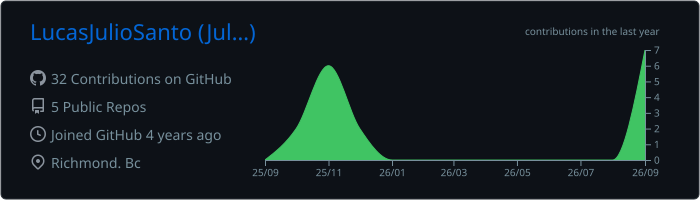

<h1 align="center">Hi, I'm Julio 👋</h1>
<h3 align="center">Computer Information Technology Student @ BCIT · Aspiring Cybersecurity Engineer</h3>

<p align="center">
  
</p>

<p align="center">
  <a href="mailto:santosrosajulio@gmail.com"></a>
  
  
</p>

---

```bash
julio@bcit:~$ whoami
> CIT student at BCIT with hands-on experience across the IT stack:
> programming, databases, networking, systems, and the command line.

julio@bcit:~$ cat focus.txt
> Cybersecurity: network defense, secure systems, and threat analysis.

julio@bcit:~$ echo $GOAL
> Build secure, reliable systems and help organizations stay ahead of threats.
```

---

### 🧩 What I Bring

- **Linux & the command line:** comfortable working in the terminal and administering Linux servers
- **Cloud & containers:** deploying and configuring services on AWS EC2 with Docker and Nginx
- **Secure configuration:** SSH key-only access, AWS Security Group rules, and keeping secrets out of code
- **Scripting & automation:** Python and Bash for automating tasks
- **Databases:** writing SQL queries and working with MySQL
- **Problem solving:** troubleshooting issues methodically until they're fixed

---

### 🛠️ Tech Stack

**Languages**


**Databases**


**Tools & Platforms**


---

### 📂 Projects

#### ☁️ [AWS Docker Nginx Website](https://github.com/LucasJulioSanto/aws-docker-nginx-website)

A cybersecurity-themed personal website deployed on **AWS EC2** and served by **Nginx** running in a **Docker** container, built with security in mind from the start.

<p align="center">
  
</p>

- Launched and configured an Amazon Linux EC2 instance with SSH key-only access and an Elastic IP
- Containerized Nginx with a read-only bind mount and limited the web root to the `site/` folder so the `.git` directory is never exposed
- Set up Security Group rules for HTTP traffic and kept secrets out of the repo with `.gitignore`
- Troubleshot and resolved Docker port conflicts during deployment

`AWS EC2` · `Docker` · `Nginx` · `Linux` · `HTML/CSS/JavaScript` · `Git`

---

### 📈 GitHub Stats

<p align="center">
  
</p>
<p align="center">
  
  
</p>
<p align="center">
  
</p>

---

### 🔐 Cybersecurity Interests

- Network security and traffic analysis
- Linux hardening and system administration
- Cloud security and secure deployment
- Incident response and threat detection

---

### 🚀 Currently

```bash
julio@bcit:~$ ls ./in-progress
> aws-docker-nginx-website/ ✓   security-projects/   linux-labs/   ctf-writeups/
```

- 🎓 Completing the Computer Information Technology program at BCIT
- 🔎 Building more hands-on cybersecurity projects
- 🤝 Open to co-op, internship, and entry-level IT jobs

<details>
<summary><b>⚡ More about me</b></summary>

- 🌱 Currently learning: network security and Linux hardening
- 💬 Ask me about: AWS, Docker, Linux, and the command line
- 🎮 Fun fact: (add something about you here!)

</details>

---

<p align="center"><code>julio@bcit:~$ exit</code> · Thanks for stopping by!</p>
